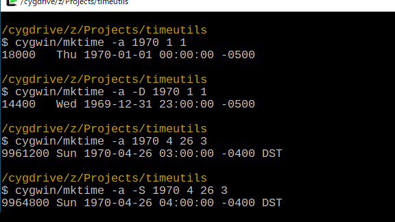

mktime コマンド
===============

**使用法**
```
  mktime [OPTION]... [-S|-D] [-]YEAR [-]MONTH [-]DAY [-]HOUR [-]MINUTE [-]SECOND
```

mktime コマンドは自作した mktime 関数のテスト用コマンドです。引数にローカル時刻の年、月、日、時、分、秒（負の値も可能）を指定すると、それらの値を正しい範囲に修正して結果を表示します。-S や -D オプションで指定した時刻に夏時間が有効かどうかを指定できます。

**指定できる時刻（00:00 - 23:59）**

| mktime                         |   日付の最小値    |   日付の最大値   |
| ------------------------------ | ----------------: | ---------------: |
| Cygwin（`time_t` が 32 ビット）|        1901-12-14 |       2038-01-17 |
| Cygwin（`time_t` が 64 ビット）| -2147481748-01-01 | 2147483647-12-31 |
| MSVCRT                         |        1970-01-01 |       3000-12-31 |
| 自作関数                       |      -27627-04-20 |      30828-09-13 |

Cygwin の mktime コマンドは `time_t` 型が 1970-01-01 00:00 UTC からの秒で表せる時刻（関数に渡す時に年は 1900 引かれる）を指定できます。タイムゾーン情報は tz database が使用され、指定する年に対して UTC オフセットや夏時間期間が決められています。

一方、MSVCRT は指定できる時刻が [Microsoft の仕様](https://learn.microsoft.com/ja-jp/cpp/c-runtime-library/reference/mktime-mktime32-mktime64) で決められ、 1970-01-01 00:00 UTC からの秒が負になる値は取れません。各タイムゾーンの UTC オフセット、夏時間期間は固定です。

自作関数コマンドは `FILETIME` 構造体で表せる時刻を指定できます。Windows 2000 や XP は Win32 の GetTimeZoneInformation 関数しか使えず、タイムゾーンに関して MSVCRT と同じです。しかし、Vista 以降は GetTimeZoneInformationForYear 関数の使用（Vista でビルドした場合は不可）で、指定する年に対してオフセットは変わらないものの、主要なタイムゾーンで 2000 年代に行われた夏時間期間の変更が反映されます。

### mktime の仕様

POSIX で定められた [mktime](https://pubs.opengroup.org/onlinepubs/9799919799/functions/mktime.html) 関数は引数で `tm` 構造体へのポインタを受け取り、含まれる `tm_year`、 `tm_mon`、 `tm_mday`、 `tm_hour`、 `tm_min`、 `tm_sec` メンバの値をローカル時刻の年、月、日、時、分、秒として 1970-01-01 00:00 UTC からの秒に変換して返します。`tm` 構造体はその他に `tm_wday`、`tm_yday`、`tm_isdst` メンバを含みます。

`tm_mon`、 `tm_mday`、 `tm_hour`、 `tm_min`、 `tm_sec` が月、日、時、分、秒の範囲を超える値を持つ場合、それぞれが正しい範囲内に収まるように値を調整して `tm_year` を含めた時刻を表すメンバに戻します。また、その曜日や年内日数を計算して `tm_wday`、`tm_yday` に格納します。

変換された秒はタイムゾーンのオフセットに合わされます。さらに、`tm_isdst` メンバの値がタイムゾーンの夏時間の調整をするかどうか制御します。正の場合は夏時間のオフセットに合わせ、ゼロの場合は合わせません。負の場合は指定した時刻に対して夏時間が有効かどうか判断し、有効な場合は `tm_isdst` が正の時と同じ、そうでない場合は `tm_isdst` がゼロの時と同じ結果になります。時刻が夏時間への、または、夏時間からの移行が発生する時間の場合、どちらの結果になるかは未指定です。

夏時間が有効な時に `tm_isdst = 0` を指定された場合、正の `tm_isdst` を戻して他のフィールドを適切に変更します。

### mktime の実装

mktime の仕様はリンク先の "DESCRIPTION" をざっくりと要約したものです。夏時間の記述が多い訳は `tm_isdst` に関する処理が分かりづらいからで、最後の一文にいたっては "APPLICATION USAGE" にひっそりと書かれています。これは受け取った `tm_isdst` によって `tm` 構造体の時刻を調整すると読めます。

それでは「適切な変更」について mktime コマンドで調べましょう。まず、タイムゾーンを東部標準時 `UTC-05:00` に設定します。ローカル時刻 1970-01-01 00:00 では UTC から５時間遅れているため、`18000` 秒に変換されます。`tm_isdst = 1` を（`-D` オプションで）指定すると、変換された秒と時刻から夏時間の進んでいる `60` 分が引かれます。逆に、夏時間が有効な時では `tm_isdst = 0` を（`-S` オプションで）指定すると、変換された秒と時刻に遅れている `60` 分が足されます。



`tm_isdst` に指定された値は `tm` 構造体の時刻が夏時間かどうかを示し、mktime 関数はそれが実際と異なる場合に「適切な」調整していることになります。また、その値に関係なく夏時間が有効かどうか判断して `tm_isdst` に正の値や `0` を戻します。この mktime の 動作結果は Cygwin と MSVCRT で同じです。

ところで、標準時と夏時間の移行時の時刻に対しては仕様が定まっていません。東部標準時では夏時間への移行時に 02:00 から 03:00 がスキップされ、夏時間からの移行時に 01:00 から 02:00 が２回繰り返されます。移行時について Cygwin と MSVCRT で検証した結果、以下の通りになりました。

**夏時間への移行時（02:30）**

|               |  Cygwin   |  MSVCRT   |
| ------------- | --------- | --------- |
| tm_isdst = 1  | 01:30     | 01:30     |
| tm_isdst = 0  | 03:30 DST | 03:30 DST |
| tm_isdst = -1 | 03:30 DST | 01:30     |

**夏時間からの移行時（01:30）**

|               |  Cygwin   |  MSVCRT   |
| ------------- | --------- | --------- |
| tm_isdst = 1  | 01:30 DST | 01:30 DST |
| tm_isdst = 0  | 01:30     | 01:30     |
| tm_isdst = -1 | 01:30 DST | 01:30     |

`tm_isdst = -1` を指定した場合、両方の移行時で Cygwin は夏時間が有効、MSVCRT は有効でないと判断し、`tm_isdst = 0` や `tm_isdst = 1` を指定した場合の結果と同じになりません。移行時に対しては "it is unspecified" と仕様に書かれているのですが、時刻をスキップしたり、繰り返したりするため調整が行われたということでしょうか。
